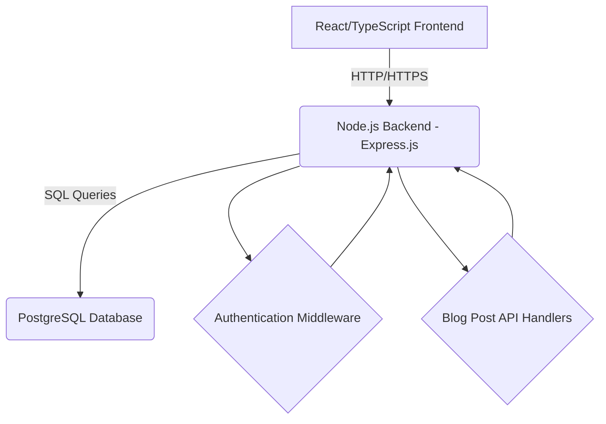

# Backend Architecture and Technology Stack Plan

This document outlines the recommended backend architecture and technology stack for the project, considering the existing React/TypeScript frontend and future e-commerce capabilities.

## 1. Recommended Backend Framework: Node.js with Express.js

**Justification:**
*   **JavaScript/TypeScript Ecosystem:** Aligns with the existing React/TypeScript frontend, enabling a full-stack JavaScript/TypeScript development environment. This reduces context switching, allows for potential code sharing, and simplifies dependency management.
*   **Performance (I/O-bound):** Node.js is highly efficient for I/O-bound operations, which are prevalent in web applications (e.g., handling concurrent requests, database interactions). This makes it suitable for authentication, CRUD operations, and future e-commerce transactions.
*   **Large Community & Ecosystem:** Express.js provides a flexible and robust framework with a vast ecosystem of middleware and libraries, ensuring ample support and readily available solutions.
*   **Scalability:** Node.js applications can be scaled horizontally by running multiple instances, making them well-suited for growing applications and high traffic loads.

## 2. Recommended Database: PostgreSQL

**Justification:**
*   **Relational Data Integrity:** For structured data like user accounts, blog posts, and future e-commerce entities (products, orders), PostgreSQL offers strong data integrity, ACID compliance, and robust transaction management. This is critical for authentication, data consistency, and financial transactions.
*   **Maturity & Reliability:** PostgreSQL is a mature, open-source, and highly reliable database system with a proven track record of stability and performance.
*   **Flexibility (JSONB):** While primarily relational, PostgreSQL supports JSONB columns, offering flexibility to store semi-structured data within a relational schema if future features require it, without necessitating a NoSQL migration.
*   **Security Features:** Includes advanced security features essential for handling sensitive user authentication and payment-related data.

## 3. High-Level API Endpoints Overview

### Authentication Endpoints:
*   **`POST /api/auth/login`**
    *   **Description:** Authenticates an admin user.
    *   **Request Body:** `{ "username": "string", "password": "string" }`
    *   **Response:** `{ "token": "string", "expiresIn": "number" }` (JWT token) or error.
*   **`GET /api/auth/check`**
    *   **Description:** Verifies the validity of an authentication token.
    *   **Headers:** `Authorization: Bearer <token>`
    *   **Response:** `{ "isValid": boolean, "user": { "id": "string", "username": "string" } }` or error.
*   **`POST /api/auth/logout`**
    *   **Description:** Invalidates the current session/token (optional, depends on token strategy).
    *   **Headers:** `Authorization: Bearer <token>`
    *   **Response:** `{ "message": "Logged out successfully" }`

### Blog Post (Tek) Management Endpoints:
*   **`GET /api/teks`**
    *   **Description:** Retrieves a list of all blog posts/teks.
    *   **Query Params:** `?page=<number>&limit=<number>&search=<string>` (for pagination and search)
    *   **Response:** `[{ "id": "string", "title": "string", "content": "string", "author": "string", "createdAt": "Date", "updatedAt": "Date" }]`
*   **`GET /api/teks/:id`**
    *   **Description:** Retrieves a single blog post/tek by ID.
    *   **Response:** `{ "id": "string", "title": "string", "content": "string", "author": "string", "createdAt": "Date", "updatedAt": "Date" }`
*   **`POST /api/teks`**
    *   **Description:** Creates a new blog post/tek. (Requires authentication)
    *   **Headers:** `Authorization: Bearer <token>`
    *   **Request Body:** `{ "title": "string", "content": "string" }`
    *   **Response:** `{ "id": "string", "title": "string", "content": "string", "author": "string", "createdAt": "Date", "updatedAt": "Date" }`
*   **`PUT /api/teks/:id`**
    *   **Description:** Updates an existing blog post/tek by ID. (Requires authentication)
    *   **Headers:** `Authorization: Bearer <token>`
    *   **Request Body:** `{ "title"?: "string", "content"?: "string" }`
    *   **Response:** `{ "id": "string", "title": "string", "content": "string", "author": "string", "createdAt": "Date", "updatedAt": "Date" }`
*   **`DELETE /api/teks/:id`**
    *   **Description:** Deletes a blog post/tek by ID. (Requires authentication)
    *   **Headers:** `Authorization: Bearer <token>`
    *   **Response:** `{ "message": "Tek deleted successfully" }`

## 4. High-Level Architecture Diagram

## 5. Backend Hosting Strategy: Platform as a Service (PaaS)

For a new project like a blog backend, starting with a PaaS like **Render** or **Heroku** is the most straightforward and cost-effective approach, especially during initial development and deployment. They provide managed PostgreSQL databases as well, simplifying the entire stack.

### Heroku vs. Render Comparison:

#### Heroku
*   **Overview:** Pioneering PaaS provider, known for simplicity and "Git-push deployment."
*   **Key Features:** Buildpacks for automatic Node.js detection, managed Heroku Postgres add-on, Dynos for isolated containers and easy scaling, rich Add-ons Marketplace, powerful CLI.
*   **Deployment:** Push code to a Heroku Git remote; Heroku handles build and deployment.
*   **Pricing:** Free tier with limitations (dyno sleeping), paid tiers based on dyno hours and add-on usage.
*   **Considerations:** Can become relatively expensive at higher scales.

#### Render
*   **Overview:** Modern cloud platform aiming for developer-friendly PaaS with IaaS flexibility.
*   **Key Features:** Unified platform for web services, databases, cron jobs; managed PostgreSQL databases; automatic deployments from Git repos; custom domains & free SSL; zero-downtime deployments.
*   **Deployment:** Connect Git repository, configure service; Render handles continuous deployment.
*   **Pricing:** Generous free tier for static sites and databases, competitive pricing for web services.
*   **Considerations:** Still growing its ecosystem but rapidly adding features.

**Recommendation:** **Render** is often a more modern and cost-effective starting point, with a strong focus on developer experience and a more generous free tier for databases.

## 6. Scaling Strategies

Scaling ensures your application can handle increased traffic and data over time.

### Vertical Scaling (Scaling Up)
*   **Concept:** Increasing resources (CPU, RAM) of a single server instance.
*   **Applicability:** Upgrade to a more powerful Node.js service instance or a larger PostgreSQL database plan on PaaS.
*   **Pros:** Simpler initially.
*   **Cons:** Limited by physical hardware, potential single point of failure.

### Horizontal Scaling (Scaling Out)
*   **Concept:** Adding more server instances to distribute the load. Generally preferred for web applications due to flexibility and resilience.
*   **Applicability:**
    *   **Node.js Express:** Run multiple application instances behind a load balancer (PaaS handles this automatically). Requires stateless application design (e.g., using JWTs for authentication).
    *   **PostgreSQL:** Use read replicas for read-heavy applications. Sharding/partitioning is a more complex strategy for extreme write loads.
*   **Pros:** Highly scalable, provides fault tolerance, better resource utilization.
*   **Cons:** Adds complexity (managing instances, ensuring statelessness).

**Scaling for Blog Backend:** Start with horizontal scaling for the Node.js application (using JWTs for authentication). For PostgreSQL, a single, appropriately sized instance is usually sufficient initially; consider adding read replicas if read traffic becomes a bottleneck.

## 7. Future Considerations: Shop Page / E-commerce

The chosen stack (Node.js with Express.js and PostgreSQL) is well-suited for future e-commerce functionality due to Node.js's high concurrency and PostgreSQL's transactional integrity (ACID compliance) and robust relational capabilities.

### Key Considerations for a Future Shop Page:
*   **Data Modeling:** New database tables for `Products`, `Orders`, `OrderItems`, `Users`, and `Cart`. PostgreSQL will manage these complex relationships efficiently.
*   **Transactional Logic:** Critical for order placement (creating order, order items, decrementing inventory, processing payment). PostgreSQL transactions are essential for atomicity.
*   **Payment Gateway Integration:** Integration with third-party providers (e.g., Stripe, PayPal) via Node.js SDKs.
*   **Inventory Management:** Accurate stock updates and handling concurrency issues using database transactions with proper locking.
*   **Security and Compliance:** Adherence to PCI DSS (preferably by offloading sensitive card data to payment gateways), strict input validation, and robust authentication/authorization.

The current backend architecture provides a strong foundation, allowing for the addition of new modules and database schemas for e-commerce without a complete architectural overhaul.